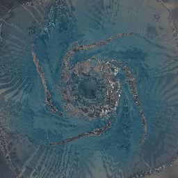
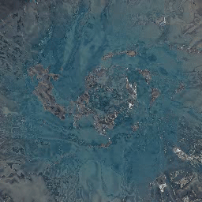

# 🧪 Viscnet

**Viscnet** is a computer vision-based viscometer designed for industrial and laboratory use, specifically targeting **Newtonian fluids**. It leverages deep learning to estimate viscosity directly from video data using CFD generated datasets.

## 📁 Repository Structure Before Training

Make sure your dataset is organized as follows:
```text
dataset/
└── {project_name}/
    ├── videos/
    │   └── *.mp4
    └── parameters/
        └── *.json
```

## Example dataset

<table>
  <tr>
    <td align='center'><strong>Decaying Vortex, High Viscosity</strong><br></td>
    <td align='center'><strong>Decaying Vortex, Low Viscosity</strong><br></td>
  </tr>
</table>

## 🚀 How to Start Training

```bash
cd slurry_viscnet
bash scripts/setup.sh
bash scripts/dev.sh
```

- Mainly based on cuda12.1 env. check requirements.txt for details
- You can modify `configs/config.yaml` to customize training behavior.
