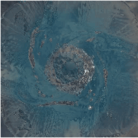
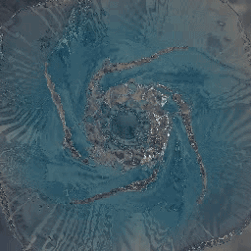

# 🧪 Viscnet

**Viscnet** is a computer vision-based viscometer designed for industrial and laboratory use, specifically targeting **Newtonian fluids**. It leverages deep learning to estimate viscosity directly from video data using CFD generated datasets.

It is expected to be updated for non-Newtonian fluids and ultimately to battery slurries

## 📁 Repository Structure Before Training

Make sure your dataset is organized as follows:

```text
dataset/
└── {project_name}/
    ├── videos/
    │   └── *.mp4
    └── parameters/
        └── *.json
```
change the {project_name} to your desired dataset


### Example dataset

#### Static vortex;


#### Decaying vortex


## 🚀 How to Start Training

```bash
cd slurry_viscnet
bash scripts/setup.sh
bash scripts/dev.sh
```
You can modify `configs/config.yaml` to customize training behavior.
